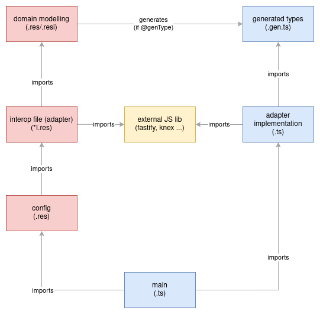

# 

> ### [Rescript](https://rescript-lang.org/) codebase containing real world examples (CRUD, auth, advanced patterns, etc) that adheres to the [RealWorld](https://github.com/gothinkster/realworld) spec and API.

For more information on how to this works with other frontends/backends, head over to the [RealWorld](https://github.com/gothinkster/realworld) repo.

_The purpose of this repo is to showcase a realworld example of how rescript can integrate a typescript codebase in order to ease its adoption (... and get the best of both worlds ?)._

# How it works

> This project uses [hexagonal architecture](https://en.wikipedia.org/wiki/Hexagonal_architecture_(software))
>
> Rescript is mainly used for domain modelling (domain & usecases)
>
> TypeScript is used for adapters implementation

## 2-step compilation



### rescript
`.res` & `.resi` are rescript files, they are normally built directly to `javascript`, ending up directly in the `./lib/js/` folder (not committed)

But rescript can also generate typescript files next to the rescript files containing some `@genType` decorators. These new files have a `.gen.ts` extension

### typescript
Pure typescript files use the standard `.ts` extension and can make use of the `.gen.ts` previously generated for interop between the two languages (to get types).

Both `.gen.ts` & `.ts` files are built using `tsc` and will end up as javascript files in the `./lib/js/` folder

# Getting started

> npm install, npm build

## start the server
```
npm run start
```

```
curl -XPOST -v localhost:3000/ -d '{"mail": "hello@bla.com", "name": "salut", "password": "myPass"}' -H "Content-Type: application/json"
```

# Development

[API contract documentation](https://realworld-docs.netlify.app/docs/specs/backend-specs/endpoints)


